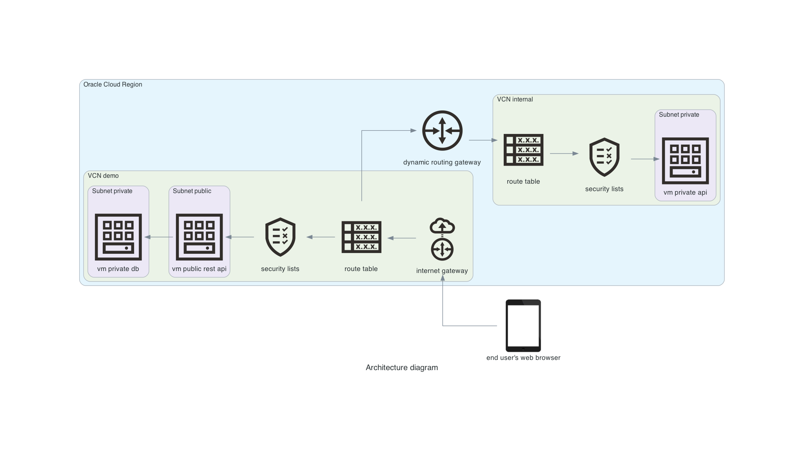

# Build infrastructure as a code (IaC) using test-later development (TLD) method

If you are interested in building infrastructure as a code and in testing resources deployed in the cloud, if you want to increase confidence in your changes deployed on production, then I invite you to my lecture. I'm going to present a pyramid of tests in the context of infrastructure and I'm going to show practical examples of how to do unit tests, contract tests and integration tests for resources provisioned by Terraform. During my live demo some tests are going to fail, some of them are going to pass, but I hope that I will not disappoint and presented material will be useful while building your infrastructure. 

## Presentation summary

Using test-driven development (TDD) approach in software development is broadly used in industry for many years. When we are talking about infrastructure, it's not as obvious and frequently used approach, but when we take a look on [pyramid of tests](https://www.hashicorp.com/blog/testing-hashicorp-terraform) and think about tools available for infrastructure as a code (IaC), then we can propose multiple approaches to do:
- unit tests using built-in tools available e.g. in Terraform like ``terraform fmt``, ``terraform validate`` or external programs like [conftest](https://www.conftest.dev/)
- contract tests using [validations for variables](https://www.terraform.io/language/values/variables), [lifecycle pre-conditions for resources](https://www.terraform.io/language/expressions/custom-conditions) or external tools like [kitchen-terraform](https://github.com/newcontext-oss/kitchen-terraform)
- integration tests using [``terratest``](https://terratest.gruntwork.io/), [``localstack``](https://localstack.cloud/) or other local / non-production environments
- end-to-end tests using also [``terratest``](https://terratest.gruntwork.io/)

As we have a lot of types of tests, we have also different approaches when and how to write them. In case of TDD there is common cycle - writing failing test (red phase), implementing code which causes that tests is succeeding (green phase) and adjusting code (refactor phase). For infrastructure sometimes it's very hard to write tests before implementation e.g. validation rule variable can be created after variable is defined, not before, that's why in many cases for IaC we can talk about test-later development (TLD) method.

## Demo

### Architecture diagram

### Quickstart

1. Register and activate account in [Oracle Cloud](https://cloud.oracle.com/)
1. Register and activate account in [Terraform Cloud](https://app.terraform.io/)
1. Install prerequisites on local machine:
   1. [Terraform](https://learn.hashicorp.com/tutorials/terraform/install-cli)
   1. [OCI](https://docs.oracle.com/en-us/iaas/Content/API/SDKDocs/cliinstall.htm)
   2. [Go](https://go.dev/doc/install)
2. Clone repository:
   1. ``git clone https://github.com/sebastianczech/iac-tld-devops``
   2. ``cd iac-tld-devops``
3. Configure workspace and variables values in Terraform Cloud
4. Provision infrastructure:
   1. ``cd infra``
   2. ``terraform plan``
   3. ``terraform apply -auto-approve``
5. Execute tests:
   1. ``cd tests``
   2. ``make auth``
   3. ``make test``